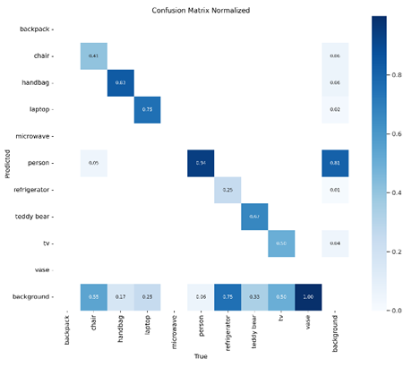
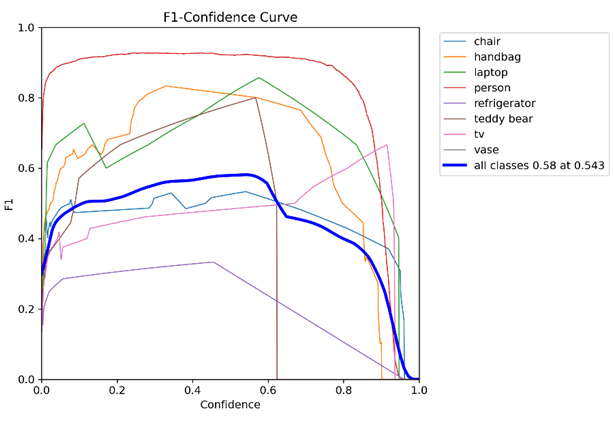
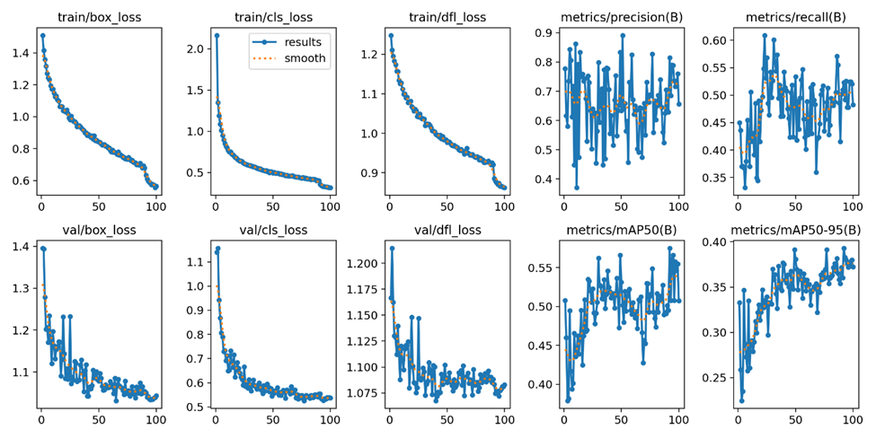

# EECE 490 Project Report

**David Abboud**  
**Ralph Fata**  
**Mostafa Kassem**

## 1. Introduction
Our project investigates the YOLOv8 algorithm and library to explore the different functionalities it offers. Then, we trained a YOLOv8n on surveillance images and we present the results below. Lastly, we developed a surveillance system that can be implemented to work on the local machine or on a Raspberry Pi.

## 2. The YOLO Library
YOLOv8 is an implementation of the renowned YOLO (You Only Look Once) object detection algorithm. YOLO is known for its speed and accuracy, making it a widely used choice for real-time object detection tasks. What makes YOLO special is its ability to detect objects in images or video frames in a single pass through the neural network, making it incredibly fast compared to other object detection algorithms. YOLO divides the input image into a grid and predicts bounding boxes and class probabilities for each grid cell. This approach allows YOLO to detect multiple objects of different classes in a single image efficiently.

YOLOv8 specifically introduces improvements and optimizations like better feature extraction, network architecture enhancements, and training techniques, resulting in more precise object detection. It can be applied in various fields such as autonomous driving, surveillance, robotics, and image analysis in healthcare. Its ability to detect a wide range of classes including people, vehicles, animals, and various objects makes it versatile for many applications. Additionally, YOLOv8 allows for the addition of custom classes, enabling users to train the model to detect specific objects relevant to their use case.

The YOLOv8 library provides functionalities for:

1. **Training**: It allows users to train the YOLOv8 model on their own dataset for custom object detection tasks.
2. **Inference**: The model can be used for real-time object detection in images or video streams of different types.
3. **Evaluation**: The library includes tools for evaluating the performance of the trained model on a validation dataset, helping users assess its accuracy and make improvements if necessary.

Models range from smaller, lightweight versions suitable for deployment on edge devices (such as the Nano model) to larger, more accurate models with increased computational cost (such as the Extra Large model). In terms of computational cost, YOLOv8 models are generally efficient compared to other object detection algorithms, especially considering their real-time capabilities. The cost increases as the model gets bigger. There are 5 sizes: nano, small, medium, large, and extra large. Thus, to minimize cost, we select the smallest model, and we apply batch processing, as well as using the local GPU for training. We can also perform edge computing by deploying the YOLOv8 model directly on edge devices like the Raspberry Pi to perform inference locally, minimizing the need for data transfer.

## 3. The Trained Model
We use the YOLOv8 Nano model to perform transfer learning. The system uses the nano version of YOLOv8 because it is the fastest due to its smaller network and fewer parameters, making it ideal for implementing on a Raspberry Pi.

We use data collected from Roboflow, which is a tool for annotating and storing data sets. All of our data, around 2500 images from surveillance cameras, was already annotated and publicly available, as well as separated into training, validation, and test sets. We used Roboflow to automatically import it into our Virtual Environment. Then, after training for around 2 hours or 100 epochs on the local machine GPU, we were able to further specialize our model on person detection, as most of the data is related to persons. The results obtained are seen below:

## 4. The Application
We have developed a surveillance camera using the model above. This camera can either be used with the local machine camera, or a modified version of the code, which we also submitted, can be used on a Raspberry Pi connected to a USB camera. The system actively looks for humans by continuously taking snapshots and applying the model prediction on them.

As soon as the model detects one person, an email is sent to the customer. The email contains the snapshot, the number of persons seen, and the exact time of the recording. In addition, after a uniformly random interval of 45 to 75 seconds, if there is still at least one human detected, an email is sent again. During this process and at any point in time, if an increase in the number of humans is observed, an email is also sent. Additionally, if a screen is available, the user can see the bounding boxes and probabilities as well as all the default 80 classes on top of the live video recorded by the camera.

